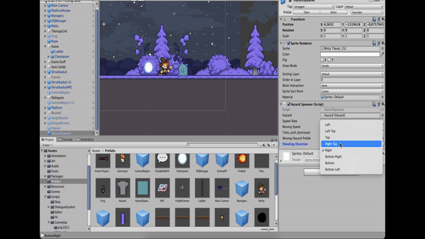

## 2D Platformer Game

In this readme file you can find a list of my contributions as a software engineer towards this 2D platformer game titled 'Illusions Firefly'. My contributions involve the gameplay programming for 2 mini games as well as enemy AI, Hazards, Hazard Spawner, Background Music for player death, boss appearance etc., SFX for various player and enemy interactions

## Gameplay Programming Contributions

1. Melee Enemy
- Simple melee enemy that strikes forward
- Enemy will walk from left to right repeatedly on its platform and only stop to attack when the Player is in front of them
- Enemy will not fall or walk off of its platform
Animations: Idle, walk forward, attack, hurt (when it gets hit for a moment), death.

2. Ranged Enemy
- Simple ranged enemy that shoots a projectile
- Enemy will stand in place in idle animation until the player is close enough to attack
Animations: idle, shoot, hurt, death

3. Hazards:
A Hazard Component that can be added to an object that damages the Player when it touches them, so that it can be added to many
different things.

4. Hazard spawner:
This object will spawn hazard projectiles which shoot in whichever of the 8 directions enabled by checking a public boxes of Left, Up+Left, Up,
Up+Right, Right, Down+Right, Down, Down+Left.
 - The hazards should be despawned after a certain number of seconds which should be able to adjust.
 - The hazard spawner should also have a cooldown/spawn rate which should be able to adjust.
Animations: traveling, destruction

5. Animation SFX
- Script to allow designer to attach an audio file and get it to play alongside an animation at specific points during the animation cycle.

6. Background Music
Background Music that changes based on changing scenes or starting boss fights

###### Universal Mini Game Rules:

1. Mini games will have 3 different ending conditions: 
Critical Failure, Success, and Fantastic.

2. The ending condition of a mini game will affect the next mini game that will be played. Critical Failures will end the game completely, so you really only need to track whether the last mini game played was a "Success" or "Fantastic".
If your last mini game was "Fantastic" then the next mini game you play
will only be slightly easier.

## Sweat Mini Game:

1. Have 5 different kinds of sweat drops
(so they don't all look exactly the same)
that can spawn randomly at a certain (and adjustable)
spawn rate within a designated spawning zone.
(Like one per every 0.5 seconds or something)

2. Move the hand with WASD keys, arrow keys,
and the Joysticks if played with a controller.
The hand becomes clenched if you click down the mouse button
as well as one of the main buttons if using a controller.

3. The clenched hand will wipe away (destroy) the sweat beads with one swipe.
But an open hand will take 2 swipes to destroy them.

4. The sweat beads will "Die" on their own once they reach the end of their animation.
This will not count as "wiping" them, and a certain amount of missed sweat beads
will result in a critical failure.

Condition for Winning and Losing:
A certain amount of missed Sweat beads will result in a Critical Failure,
a lesser amount will just result in a normal "Success"
and the mini game will end once you either "Wipe" a certain amount of sweat beads,
or if you miss the amount of sweat beads that results in a Critical Failure.

## Truthpick Mini Game:

1. Make the hand shake a little bit (both up/down and left/right).

2. Move the hand with the WASD and arrow keys as well as the joystick for controllers.

3. Clicking the mouse (or one of the main buttons for a controller)
will "Grab" in a way that lets you grab the Truthpick,
but you can't get too close to it, or else you'll get "Pricked"
by one of the 2 toothpicks on each side.

4. Hold the mouse button down to keep holding the Truthpick,
letting go of the mouse/grab button will open your hand again.

Condtition for Winning and Losing:
Getting Pricked too many times will result in a Critical Failure.
A smaller amount of pricks than that will just be a "Success"
once you finish the game, and a "Fantastic" will be from not getting pricked a single time.